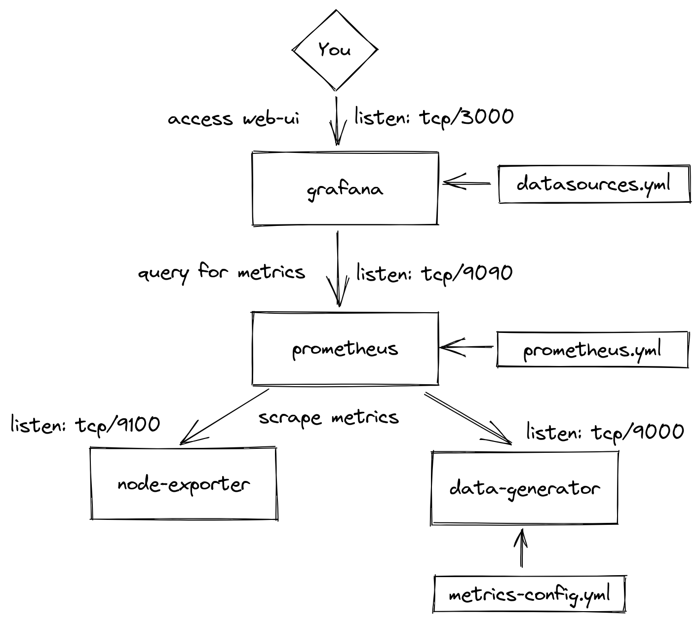

# Grafana & Prometheus Playground Project

> This is *not* a production ready prometheus/grafana stack! This is intended for local testing only!

This small repo spins up a local Prometheus and Grafana stack as well as a metrics generator to play around with grafana dashboards using somewhat realistic data.

Projects used:
* [Grafana](https://github.com/grafana/grafana)
* [Prometheus](https://github.com/prometheus/prometheus)
* [Node-Exporter](https://github.com/prometheus/node_exporter)
* [Prometheus Data Generator](https://github.com/little-angry-clouds/prometheus-data-generator)

## Prerequisites

* [podman](https://podman.io/) or docker
* [podman-compose](https://github.com/containers/podman-compose) or the docker equivalent

> This README assumes you are using `podman-compose`. If you're on `docker`, you should be able to just substitute `podman-compose` with `docker-compose`. But i did not test it with docker-compose.

## Getting Started

* Start the stack by running:
  ```
  podman-compose up --force-recreate
  ```
* Then, access the grafana UI at [localhost:3000](http://localhost:3000)
* Use `admin:admin` as the credentials

## Configuring Fake Metrics

You can customize the metrics generated by the prometheus-data-generator by editing [metrics-config.yml](./metrics-config.yml):

```
---
config:
  - name: oauth_server_requests_total
    description: oauth requests
    type: counter
    labels:
      - container
      - code
    sequence:
      - eval_time: 1
        values: 1-50
        operation: inc
        labels:
          container: oauth-server
          code: 500
      - eval_time: 1
        values: 2000-5000
        operation: inc
        labels:
          container: oauth-server
          code: 200
```

See [github.com/little-angry-clouds/prometheus-data-generator](https://github.com/little-angry-clouds/prometheus-data-generator) for a complete documentation on config.

After changing the file, you will need to trigger a config reload. You can either restart and recreate the whole stack or visit [localhost:9000/-/reload](http://localhost:9000/-/reload) in your browser to trigger a reload of the generator.

Alternatively, issue an HTTP-Get request on the command line using curl:
```
curl http://localhost:9000/-/reload
```

## Running tests

The stack now supports running the prometheus unit tests. Make sure [test.yml](./test.yml) contains your [prometheus unit test definitions](https://prometheus.io/docs/prometheus/latest/configuration/unit_testing_rules/), then run:

```
make tests
```
to run the unit tests.

## Overview

Here is a birds eye view of the docker-compose stack that is set up:

